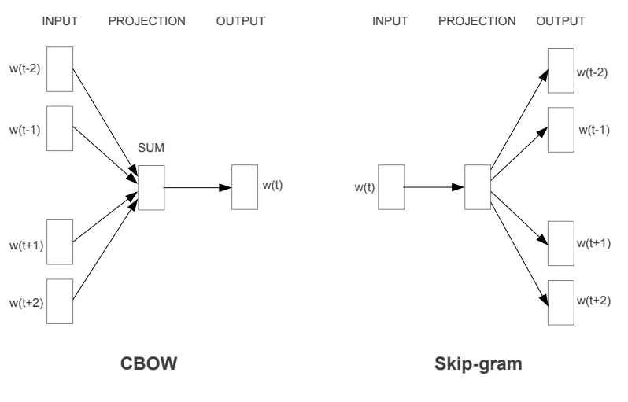

# Language Modeling Using Deep Learning

This repository presents a collection of papers about language modeling using Neural Networks. 

Language modeling aims to assign a probability to the next word in a sentence and it is very important for the field of Natural Language Processing (NLP). Although each NLP application has a different purpose, majority of the modern NLP applications build an artificial language model as a first step. After obtaining a trained (LM), it can be used in a variety of taks such as machine translation, speech recognition, question answering, handwriting recognition, text generation.

Most of the below papers/topics are summarized in the master's thesis study[1]. The thesis aimed to model the natural language (Turkish) using the LSTM network. A trained language model was used to perform some NLP tasks such as sentence generation and predicting words in a sentence. The main motivation of this research was to analyze the correlation between human and language model's word predictions in the same test sentences. The same LSTM architecture was then trained for English. It is used to produce predictability scores for each words in scope of [CMCL 2021 Shared Task](https://cmclorg.github.io/shared_task). These scores were used as an input to another LSTM model to predict to eye movements of a human reader. Details can be found in the paper[2].

1. Algan, A. C. (2021). Prediction of words in Turkish sentences by LSTM-based language modeling (Master's thesis, Middle East Technical University).
2. Balkoca, A., Algan, A., Acartürk, C., & Çöltekin, Ç. (2021, June). Team ReadMe at CMCL 2021 Shared Task: Predicting Human Reading Patterns by Traditional Oculomotor Control Models and Machine Learning. In Proceedings of the Workshop on Cognitive Modeling and Computational Linguistics (pp. 134-140).

| Year          | Architecture  | Title         | Link |
| ------------- | ------------- | ------------- | ------------- |
| 2000          | FFNN          | Can Artificial Neural Networks Learn Language Models? | [link](https://www.isca-speech.org/archive/archive_papers/icslp_2000/i00_1202.pdf)  |
| 2003          | FFNN          | A Neural Probabilistic Language Model | [link](https://www.jmlr.org/papers/volume3/bengio03a/bengio03a.pdf)  |
| 2006          | FFNN          | Continuous space language models | [link](https://wiki.inf.ed.ac.uk/twiki/pub/CSTR/ListenSemester2_2009_10/sdarticle.pdf)  |
| 2007          | FFNN          | Three New Graphical Models for Statistical Language Modelling | [link](http://www.cs.utoronto.ca/~hinton/absps/threenew.pdf)  |
| 2010          | RNN           | Recurrent neural network based language model | [link](https://www.fit.vutbr.cz/research/groups/speech/publi/2010/mikolov_interspeech2010_IS100722.pdf)  |
| 2010          | RNN           | Extensions of recurrent neural network language model | [link](https://ieeexplore.ieee.org/stamp/stamp.jsp?tp=&arnumber=5947611)  |
| 2012          | LSTM          | LSTM Neural Networks for Language Modeling | [link](http://www-i6.informatik.rwth-aachen.de/publications/download/820/Sundermeyer-2012.pdf)  |
| 2016          | LSTM and GRU          |  LSTM, GRU, highway and a bit of attention: an empirical overview for language modeling in speech recognition | [link](https://publications.rwth-aachen.de/record/671147/files/671147.pdf)  |

FFNN = Feed Forward Neural Network \
GRU = Gated Recurrent Units [(Chung et al., 2014)](https://arxiv.org/pdf/1412.3555.pdf)\
LSTM = Long Short-Term Memory [(Hochreiter & Schmidhuber, 1997)](http://citeseerx.ist.psu.edu/viewdoc/download?doi=10.1.1.676.4320&rep=rep1&type=pdf) \
RNN = Recurrent Neural Network 

## Word Representation

### Word2Vec
Word2Vec [(Mikolov, Sutskever, et al., 2013)](https://proceedings.neurips.cc/paper/2013/file/9aa42b31882ec039965f3c4923ce901b-Paper.pdf) implementation has achieved to produce continuous word vector for every word in the vocabulary. The method has a set of two models, Continuous Bag of Words (CBOW) and Skip-gram models.

Figure reference: (https://arxiv.org/pdf/1309.4168v1.pdf)

#### Continous Bag of Words (CBOW)
CBOW predicts the target word using surrounding words(context).

#### Skip-gram
Skip-gram predicts the surrounding words from the target word.

### Glove

[Pennington, J., Socher, R., & Manning, C. D. (2014)](https://nlp.stanford.edu/pubs/glove.pdf)

Please visit [here](https://nlp.stanford.edu/projects/glove/) for further reading.

### FastText
Previous embedding methods are able to capture semantic information of the word. However, their learning process is based on only the words of their vocabulary. To
cover OOV words, new methods are invented. One of the most popular methods, called FastText, is introduced by [(Bojanowski et al., 2017)](https://aclanthology.org/Q17-1010.pdf). As the name suggests, FastText is fast at the training phase in terms of speed while outperforms previous methods in effectiveness and handling OOV.

### Bert

## Predictability
The predictability of a word is calculating how likely the word belongs to the current context.

Below paragraph is taken from [(Algan, A. C. 2021)](https://open.metu.edu.tr/bitstream/handle/11511/89662/12626308.pdf)

Prediction plays a crucial role on language comprehension. As we read the written text, we continuously try to predict upcoming words. Predictability affects not only the speed of reading but also the movement of eyes. Therefore, predictability is one of the key variables that could explain how humans process information during reading. Predictability is the probability of knowing the upcoming word based on the previous context. The scope of the context could change. In most cases, it is preceding words in the current sentence. However, there can be larger previous contexts like previous sentences or previous paragraphs. Sometimes, contextual information is not enough to make predictions. A reader has to use prior knowledge of the language (grammar) and the real world.

### Predictability Papers
[Altmann, G. T., & Kamide, Y. (1999). Incremental interpretation at verbs: Restricting
the domain of subsequent reference. Cognition, 73(3), 247–264.](https://citeseerx.ist.psu.edu/viewdoc/download?doi=10.1.1.1068.4603&rep=rep1&type=pdf)

[DeLong, K. A., Urbach, T. P., & Kutas, M. (2005). Probabilistic word pre-activation
during language comprehension inferred from electrical brain activity. Nature
neuroscience, 8(8), 1117–1121](http://kutaslab.ucsd.edu/people/kutas/279/pdfs/2005.NN.1117.pdf)

[Huettig, F. (2015). Four central questions about prediction in language processing.
Brain research, 1626, 118–135.](https://pure.mpg.de/rest/items/item_2087802/component/file_2227069/content)

[Kuperberg, G. R., & Jaeger, T. F. (2016). What do we mean by prediction in language
comprehension? Language, cognition and neuroscience, 31(1), 32–59.](https://www.ncbi.nlm.nih.gov/pmc/articles/PMC4850025/)

[Willems, R. M., Frank, S. L., Nijhof, A. D., Hagoort, P., & Van den Bosch, A. (2016).
Prediction during natural language comprehension. Cerebral Cortex, 26(6),
2506–2516.](https://academic.oup.com/cercor/article/26/6/2506/1754078)

[Hagoort, P., Hald, L., Bastiaansen, M., & Petersson, K. M. (2004). Integration
of word meaning and world knowledge in language comprehension. science,
304(5669), 438–441.](https://pure.mpg.de/rest/items/item_60455_6/component/file_527079/content)

## Measurements
Perplexity \
Word error rate (WER)\
BLEU score\
Perplexity vs. WER https://www.cs.cmu.edu/~roni/papers/eval-metrics-bntuw-9802.pdf

