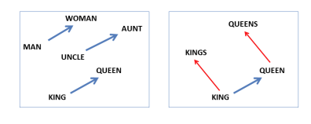

# Language Modeling Using Deep Learning

This repository presents a collection of papers about language modeling using Neural Networks. 

Language modeling aims to assign a probability to the next word in a sentence and it is very important for the field of Natural Language Processing (NLP). Although each NLP application has a different purpose, the majority of modern NLP applications build an artificial language model as a first step. After obtaining a trained (LM), it can be used in a variety of tasks such as machine translation, speech recognition, question answering, handwriting recognition, and text generation.

Most of the below papers/topics are summarized in the master's thesis study[1]. The thesis aimed to model the natural language (Turkish) using the LSTM network. A trained language model was used to perform some NLP tasks such as sentence generation and predicting words in a sentence. The main motivation of this research was to analyze the correlation between human and language model's word predictions in the same test sentences. The same LSTM architecture was then trained for English. It is used to produce predictability scores for each word in the scope of [CMCL 2021 Shared Task](https://cmclorg.github.io/shared_task). These scores were used as an input to another LSTM model to predict to eye movements of a human reader. Details can be found in the paper[2].

1. Algan, A. C. (2021). Prediction of words in Turkish sentences by LSTM-based language modeling (Master's thesis, Middle East Technical University).
2. Balkoca, A., Algan, A., Acartürk, C., & Çöltekin, Ç. (2021, June). Team ReadMe at CMCL 2021 Shared Task: Predicting Human Reading Patterns by Traditional Oculomotor Control Models and Machine Learning. In Proceedings of the Workshop on Cognitive Modeling and Computational Linguistics (pp. 134-140).

| Year          | Architecture  | Title         | Link |
| ------------- | ------------- | ------------- | ------------- |
| 2000          | FFNN          | Can Artificial Neural Networks Learn Language Models? | [link](https://www.isca-speech.org/archive/archive_papers/icslp_2000/i00_1202.pdf)  |
| 2003          | FFNN          | A Neural Probabilistic Language Model | [link](https://www.jmlr.org/papers/volume3/bengio03a/bengio03a.pdf)  |
| 2006          | FFNN          | Continuous space language models | [link](https://wiki.inf.ed.ac.uk/twiki/pub/CSTR/ListenSemester2_2009_10/sdarticle.pdf)  |
| 2007          | FFNN          | Three New Graphical Models for Statistical Language Modelling | [link](http://www.cs.utoronto.ca/~hinton/absps/threenew.pdf)  |
| 2010          | RNN           | Recurrent neural network based language model | [link](https://www.fit.vutbr.cz/research/groups/speech/publi/2010/mikolov_interspeech2010_IS100722.pdf)  |
| 2010          | RNN           | Extensions of recurrent neural network language model | [link](https://ieeexplore.ieee.org/stamp/stamp.jsp?tp=&arnumber=5947611)  |
| 2012          | LSTM          | LSTM Neural Networks for Language Modeling | [link](http://www-i6.informatik.rwth-aachen.de/publications/download/820/Sundermeyer-2012.pdf)  |
| 2016          | LSTM and GRU          |  Convolutional Neural Network Language Models| [link](https://aclanthology.org/D16-1123.pdf)  |
| 2016          | CNN          |  LSTM, GRU, highway and a bit of attention: an empirical overview for language modeling in speech recognition | [link](https://publications.rwth-aachen.de/record/671147/files/671147.pdf)  |
| 2017          | GCNN          |  Language Modeling with Gated Convolutional Networks| [link](https://arxiv.org/pdf/1612.08083.pdf)  |
| 2017          | Transformer          |  Attention Is All You Need | [link](https://arxiv.org/pdf/1706.03762.pdf)  |

CNN = Convolutional Neural Network\
FFNN = Feed Forward Neural Network \
GCNN = Gated Convolutional Neural Network
GRU = Gated Recurrent Units [(Chung et al., 2014)](https://arxiv.org/pdf/1412.3555.pdf)\
LSTM = Long Short-Term Memory [(Hochreiter & Schmidhuber, 1997)](http://citeseerx.ist.psu.edu/viewdoc/download?doi=10.1.1.676.4320&rep=rep1&type=pdf) \
RNN = Recurrent Neural Network 

### Transformer
Transformer architecture is a novel approach proposed by [Vaswani et al.](https://proceedings.neurips.cc/paper/2017/file/3f5ee243547dee91fbd053c1c4a845aa-Paper.pdf) in 2017. Transformers aims to solve sequence-to-sequence problems while handling long-term dependencies. It attracted too much attention from researchers thanks to its performance on many NLP tasks. It is learning the long-term dependencies more effectively compared to the sequential models (RNN, LSTM, GRU etc.)

## Word Representation
How to represent the words? It is one of the core tasks in NLP. Converting strings to numerical values is essential because computers can not understand anything from letters/words. The simplest idea would be to create a one-hot encoding for each word but it would result in an inefficient sparse representation where each word's vector has a length of vocabulary size. Besides the sparseness issue, the other problem is that it would be impossible to capture the relationship between the words using their vectors.

In conclusion, there are 2 main purposes;
1) Word Vectors should be in low-dimension
2) Vectors should contain the word's semantics as much as possible

Linguists had a hypothesis to define this correlation in the 1950s. It is called the Distributional hypothesis [(Joos, 1950](https://asa.scitation.org/doi/abs/10.1121/1.1906674) [Harris,
1954)](https://www.tandfonline.com/doi/pdf/10.1080/00437956.1954.11659520). Their hypothesis has been designed on the importance of context. The idea behind the distributional hypothesis is that similar words occur in a similar context.

It is very interesting that recently proposed word embeddings are the application of ideas belonging to decades ago. In 2013, Mikolov et al. invented the Word2Vec which is an efficient method to learn word vectors from large amounts of text data.

### Word2Vec
Word2Vec [(Mikolov, Sutskever, et al., 2013)](https://proceedings.neurips.cc/paper/2013/file/9aa42b31882ec039965f3c4923ce901b-Paper.pdf) implementation has been achieved to produce a continuous word vector for every word in the vocabulary. The method has a set of two models, Continuous Bag of Words (CBOW) and Skip-gram models.

Figure reference: (https://arxiv.org/pdf/1309.4168v1.pdf)

Continuous Bag of Words (CBOW)
CBOW predicts the target word using surrounding words(context).

#### Skip-gram
Skip-gram predicts the surrounding words from the target word.

From the above summary, it might not be clear how word2vec embeddings capture semantic information. All we have to arithmetic operations on vectors. For example, the below Figure shows two example relationships. On the left, gender relation is extracted by subtracting the vector(woman) from the vector(man). The result is very similar to the vector(uncle) - vector(aunt) and vector(king) - vector(queen)
On the right singular plural relation is shown.

Figure reference: (https://aclanthology.org/N13-1090.pdf)

### Glove

[Pennington, J., Socher, R., & Manning, C. D. (2014)](https://nlp.stanford.edu/pubs/glove.pdf)

Please visit [here](https://nlp.stanford.edu/projects/glove/) for further reading.

### FastText
Previous embedding methods are able to capture semantic information of the word. However, their learning process is based on only the words of their vocabulary. To
cover OOV words, new methods are invented. One of the most popular methods, called FastText, is introduced by [(Bojanowski et al., 2017)](https://aclanthology.org/Q17-1010.pdf). As the name suggests, FastText is fast at the training phase in terms of speed while outperforming previous methods in effectiveness and handling OOV. FastText uses character n-grams to learn word vectors. Therefore, it can generate word embeddings for a word that is not in its vocabulary.

### BERT
All the embeddings up until this point were the breakthrough of their time. However, there is still one big limitation of the existing word embeddings. Word2vec, Glovei FastText etc. generate word embeddings for each word and that vector is static and it only depends on the word itself. What about the polysemous words? Some words have different meanings depending on the context. For example;  
- mouse: a controlling device for a computer system  
- mouse: a type of an animal

Two cases of the word **mouse** should have different vectors depending on their usage. [Devlin et al.](https://arxiv.org/pdf/1810.04805.pdf&usg=ALkJrhhzxlCL6yTht2BRmH9atgvKFxHsxQ) addressed this issue by proposing contextualized word embeddings called BERT. BERT generates a vector for a word based on its context. It makes us of Transformer which is an attention mechanism. Typically, transformers have two components;
- encoder: read text input
- decoder: produces a prediction for the task

BERT is a language model so only the encoder is needed. The difference between BERT and the classic language models is that BERT masks some tokens during the training procedure. That's why it is called Masked Language Model(MLM).

## Predictability
The predictability of a word is calculating how likely the word belongs to the current context. The below paragraph is taken from [(Algan, A. C. 2021)](https://open.metu.edu.tr/bitstream/handle/11511/89662/12626308.pdf)

Prediction plays a crucial role on language comprehension. As we read the written text, we continuously try to predict upcoming words. Predictability affects not only the speed of reading but also the movement of eyes. Therefore, predictability is one of the key variables that could explain how humans process information during reading. Predictability is the probability of knowing the upcoming word based on the previous context. The scope of the context could change. In most cases, it is preceding words in the current sentence. However, there can be larger previous contexts like previous sentences or previous paragraphs. Sometimes, contextual information is not enough to make predictions. A reader has to use prior knowledge of the language (grammar) and the real world.

### Predictability Papers
[Altmann, G. T., & Kamide, Y. (1999). Incremental interpretation at verbs: Restricting
the domain of subsequent reference. Cognition, 73(3), 247–264.](https://citeseerx.ist.psu.edu/viewdoc/download?doi=10.1.1.1068.4603&rep=rep1&type=pdf)

[DeLong, K. A., Urbach, T. P., & Kutas, M. (2005). Probabilistic word pre-activation
during language comprehension inferred from electrical brain activity. Nature
neuroscience, 8(8), 1117–1121](http://kutaslab.ucsd.edu/people/kutas/279/pdfs/2005.NN.1117.pdf)

[Huettig, F. (2015). Four central questions about prediction in language processing.
Brain research, 1626, 118–135.](https://pure.mpg.de/rest/items/item_2087802/component/file_2227069/content)

[Kuperberg, G. R., & Jaeger, T. F. (2016). What do we mean by prediction in language
comprehension? Language, cognition and neuroscience, 31(1), 32–59.](https://www.ncbi.nlm.nih.gov/pmc/articles/PMC4850025/)

[Willems, R. M., Frank, S. L., Nijhof, A. D., Hagoort, P., & Van den Bosch, A. (2016).
Prediction during natural language comprehension. Cerebral Cortex, 26(6),
2506–2516.](https://academic.oup.com/cercor/article/26/6/2506/1754078)

[Hagoort, P., Hald, L., Bastiaansen, M., & Petersson, K. M. (2004). Integration
of word meaning and world knowledge in language comprehension. science,
304(5669), 438–441.](https://pure.mpg.de/rest/items/item_60455_6/component/file_527079/content)

## Datasets

## Measurements / Evaluation Metrics
Cross-Entropy \
Perplexity \
Word error rate (WER)\
BLEU score\
Perplexity vs. WER https://www.cs.cmu.edu/~roni/papers/eval-metrics-bntuw-9802.pdf

